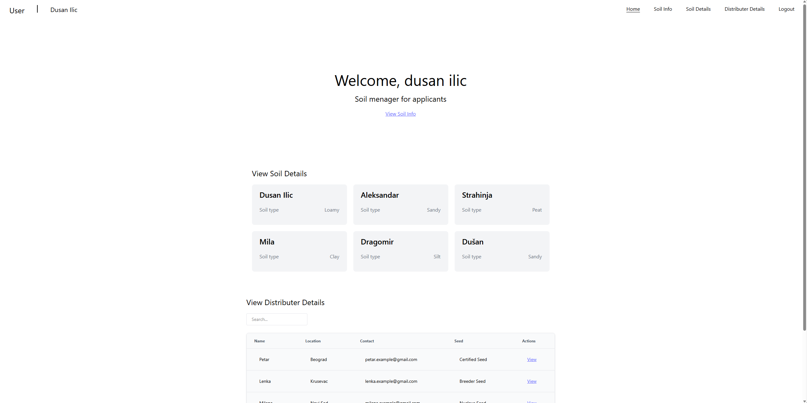
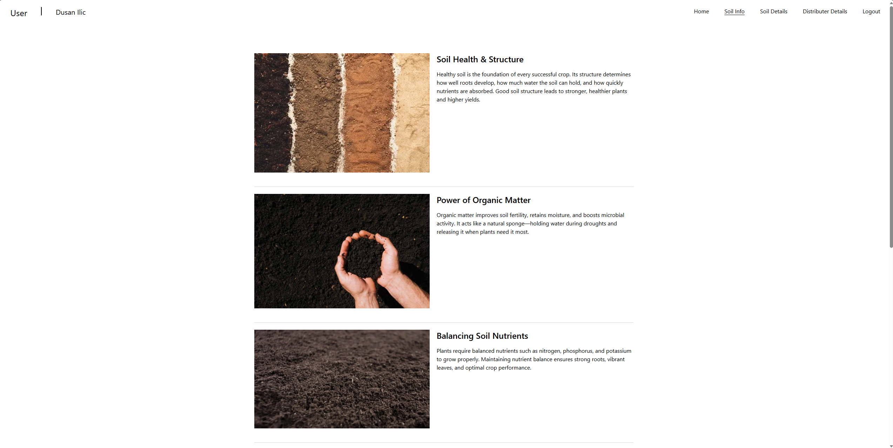
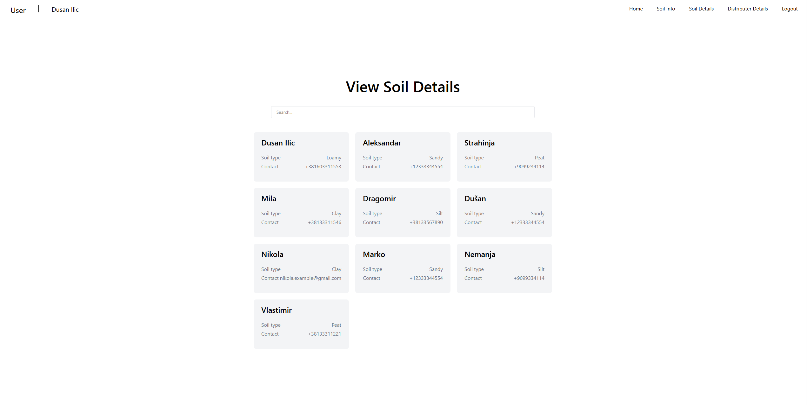
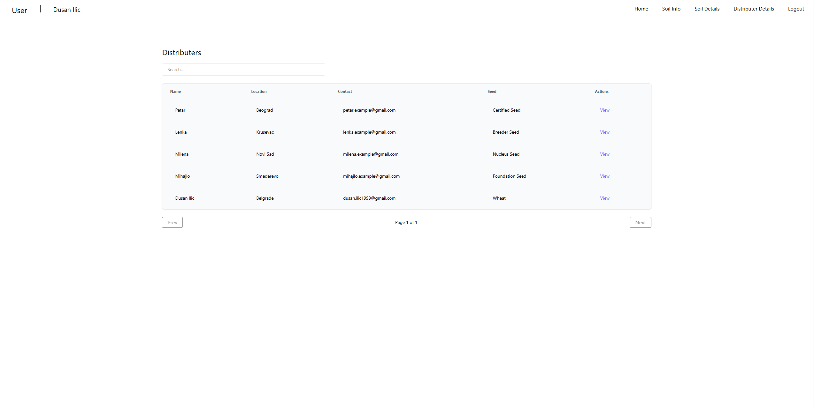

# Soil Frontend

A modern **React + TypeScript** frontend application built with **Vite**, designed to provide a clean and performant user interface for soil-related data.

---

## Table of Contents

- [Features](#features)  
- [Tech Stack](#tech-stack)  
- [Screenshots](#screenshots)  
- [Getting Started](#getting-started)  
  - [Prerequisites](#prerequisites)  
  - [Installation](#installation)
- [Usage](#usage)
- [Deployment](#deployment)
- [Contributing](#contributing)

---

## Features

- React-based UI with TypeScript    
- Static type checking and linting  
- Modular component architecture  
- Scalable structure ready for future extensions  

---

## Tech Stack

- **Framework:** React  
- **Language:** TypeScript  
- **Bundler / Build Tool:** Vite  
- **Linting:** ESLint
- **Styling** Tailwind
- **API Integration** React Query
- **Routing** React Router
---

## Screenshots

### Home Page


### Soil Info Page


### Soil Details Page


### Soil Distributors Page


---
## Getting Started

### Prerequisites

- Node.js (>= 14.x recommended)  
- npm or Yarn  

### Installation And Hosting

```bash
# Clone the repository
git clone https://github.com/zvoosh/soil-frontend.git

# Navigate into the project directory
cd soil-frontend

# Install dependencies
npm install
# or
yarn install
# Run the application
npm run dev
```

---

## Usage
The user can view filter and search for soil details and distributors, getting the details of current topic.
Admin can add new soil details and distributors.

---

## Deployment
The project is hosted on Hostinger and can be viewed on domain: https://soil.dusanprogram.eu

---
Built with ❤️ by zvoosh.